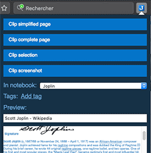

## ++Tips++


2^5

Tables : 
| Name       | Roll No   | Year | Age | Gender |
|------------|-----------|------|-----|--------|
| Satyam R   | 22CH10062 | 4th  | 22  | M      |
| Ravi kumar |           |      |     |        |
|            |           |      |     |        |
|            |           |      |     |        |
|            |           |      |     |        |


Joplin's powerful note-taking system organizes diverse facts (like the Burj Khalifa being the world's tallest building), drawings, and calculations, proving versatile for all forms of information including multimedia and scientific notation.

```cpp
#include <vector>
#include <algorithm> // Required for std::max
#include <limits>    // Required for std::numeric_limits

int kadanesAlgorithm(std::vector<int>& arr) {
    if (arr.empty()) {
        // Handle the case of an empty array.
        // Depending on problem requirements, this might return 0,
        // throw an exception, or return a specific error value.
        return 0;
    }

    int currSum = 0;
    // Initialize maxSum to the smallest possible integer value.
    // This is crucial for correctly handling cases where all numbers in the array are negative,
    // ensuring the largest negative number is returned.
    int maxSum = std::numeric_limits<int>::min();

    for (int x : arr) {
        currSum += x;

        // Update maxSum with the current maximum sum found.
        // This ensures that maxSum always keeps track of the largest subarray sum encountered so far,
        // even if currSum later becomes negative and resets.
        maxSum = std::max(maxSum, currSum);

        // If currSum becomes negative, it means that the current subarray sum
        // is contributing negatively to the overall sum. In such cases,
        // we reset currSum to 0 and start a new subarray from the next element.
        if (currSum < 0) {
            currSum = 0;
        }
    }
    return maxSum;
}
```


:{     KaTex Maths
Sum = $\sum_{i=0}^{n} K_b O$
$$x^2 + 2x + 1 = 0$$
$x_1^2 + x_2^2 = r^2$
$\frac{a}{b}$
$\sqrt[6]{100}$
$$
\sqrt{x} 
$$
$$
\sum_{i=1}^n i, \prod_{k=1}^n k, \int_{a}^{b} x^2 dx
$$
$x > 0 \text{ for all } x \in \mathbb{R}$
}:


```cpp
#define<bits/stdc++.h>
using namespace std
```

<details>
sdfasdfjasdkfjsa;dfjsakdfja;skfasdfas;dkfljas

asldkfjaslkdfja

asdflkajsd;f
asdf'asdfasf
asdflaskfa
asjkdflasdjf
flaksdfhas

</details>

:{ Hello snip
sdfasdfjasdkfjsa;dfjsakdfja;skfasdfas;dkfljas
asldkfjaslkdfja
asdflkajsd;f
asdf'asdfasf
asdflaskfa
asjkdflasdjf
flaksdfhas
}:

```cpp
hello
```

psuse

## Sample Attchment

**Hi**

```cpp
class Solution {
//Psudo Code
//Iterate through the array
// at every index find area = width*arr[i]
// width = next smaller element on left , next smaller element on right
// width = [rightNextSmallerIndex()-leftNextSmallerIndex()] + 1 ;
// int maxArea=max(maxArea,area);
// return maxArea;
public:
    int largestRectangleArea(vector<int>& heights) {
        int n=heights.size();
        stack<int>s;
        int maxArea=-1;
        int area=0;
        int currH=0;

        for(int i=0;i<n;i++){
            while(!s.empty() && heights[s.top()] > heights[i]){
                currH=s.top();
                s.pop();
                if(s.empty()){
                    area=heights[currH]*(i-(-1)-1);
                }else{
                    area=heights[currH]*(i-s.top()-1);
                }
                    maxArea=max(area,maxArea);
            }
            s.push(i);
        }

        while(!s.empty()){
            currH=s.top();
            s.pop();
            if(s.empty()){
                area=heights[currH]*(n-(-1)-1);
            }else{
                area = heights[currH]*(n-s.top()-1);
            }
            maxArea=max(area,maxArea);
        }

        return maxArea;
    }
};
```

## Web clipper



The Web Clipper is a browser extension that allows you to save web pages and screenshots from your browser. To start using it, open the Joplin desktop application, go to the Web Clipper Options and follow the instructions.

More info on the official website: https://joplinapp.org/help/apps/clipper

## Plugins

Joplin supports many plugins that allows you to add new features to the app, such as tabs, a table of content for your notes, a way to manage favourite notes, and many other ones. To add a plugin, go to the "Plugins" section in the config screen. From there you can search and install plugins, as well as search or update plugins.

## Attachments

[ASR_FairBench_interspeech.pdf](../_resources/ASR_FairBench_interspeech.pdf)  
Any kind of file can be attached to a note. In Markdown, links to these files are represented as an ID. In the note viewer, these files, if they are images, will be displayed or, if they are other files (PDF, text files, etc.) they will be displayed as links. Clicking on this link will open the file in the default application.

Images can be attached either by clicking on "Attach file" or by pasting (with `Ctrl+V` or `Cmd+V`) an image directly in the editor, or by drag and dropping an image.

More info about attachments: https://joplinapp.org/help/apps/attachments

## Search

Joplin supports advanced search queries, which are fully documented on the official website: https://joplinapp.org/help/apps/search

## Alarms

An alarm can be associated with any to-do. It will be triggered at the given time by displaying a notification. To use this feature, see the documentation: https://joplinapp.org/help/apps/notifications

## Markdown advanced tips

Joplin uses and renders [Github-flavoured Markdown](https://joplinapp.org/help/apps/markdown) with a few variations and additions.

For example, tables are supported:

| Tables        |      Are      |  Cool |
|---------------|:-------------:|------:|
| col 3 is      | right-aligned | $1600 |
| col 2 is      |   centered    |   $12 |
| zebra stripes |   are neat    |    $1 |

You can also create lists of checkboxes. These checkboxes can be ticked directly in the viewer, or by adding an "x" inside:

- [ ] Milk
- [ ] Eggs
- [x] Beer

Math expressions can be added using the [KaTeX notation](https://khan.github.io/KaTeX/):

$$
f(x) = \int_{-\infty}^\infty
    \hat f(\xi)\,e^{2 \pi i \xi x}
    \,d\xi
$$

Various other tricks are possible, such as using HTML, or customising the CSS. See the Markdown documentation for more info - https://joplinapp.org/help/apps/markdown

## Community and further help

- For general discussion about Joplin, user support, software development questions, and to discuss new features, go to the [Joplin Forum](https://discourse.joplinapp.org/). It is possible to login with your GitHub account.
- The latest news are posted [on the Patreon page](https://www.patreon.com/joplin).
- For bug reports and feature requests, go to the [GitHub Issue Tracker](https://github.com/laurent22/joplin/issues).

## Donations

Donations to Joplin support the development of the project. Developing quality applications mostly takes time, but there are also some expenses, such as digital certificates to sign the applications, app store fees, hosting, etc. Most of all, your donation will make it possible to keep up the current development standard.

Please see the [donation page](https://joplinapp.org/donate/) for information on how to support the development of Joplin.


<!-- jarvis-links-start -->
# Related notes
[1. Welcome to Joplin!](../Welcome!/1.%20Welcome%20to%20Joplin!.md)
[3. Synchronising your notes](../Welcome!/3.%20Synchronising%20your%20notes.md)
[2. Importing and exporting notes](../Welcome!/2.%20Importing%20and%20exporting%20notes.md)
[5. Joplin Privacy Policy](../Welcome!/5.%20Joplin%20Privacy%20Policy.md)
[KaTeX Cheat Sheet](../Welcome!/KaTeX%20Cheat%20Sheet.md)
<!-- jarvis-links-end -->